# 📚 Лабораторная работа №3 (Kubernetes) по курсу ИТМО "Контейнеризация и оркестрация приложений"

**Авторы:** Неронов Роман, Низамов Тимур — AI Talent Hub

---

## 🚀 Задача

Установить Kubernetes на локальную машину. Развернуть тестовый сервис.

---

## 📖 Описание

### ✨ Часть 1. Установка minikube

1. **Проверить, что все успешно установилось** — командой:

   ```bash
   minikube version
   ```

   📌 Пример вывода:

   ```
   minikube version: v1.34.0
   commit: 210b148df93a80eb872ecbeb7e35281b3c582c61
   ```

2. **Запустить minikube:**

   ```bash
   minikube start
   ```

   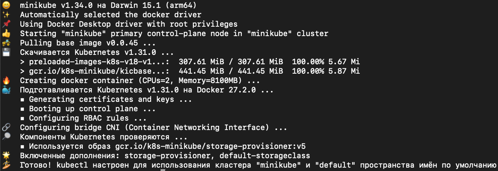

3. **Проверить, что все успешно запустилось с помощью команд:**

   ```bash
   docker ps
   ```

   

   **И**

   ```bash
   kubectl config view
   ```

   _(Должен отобразиться конфиг созданного кластера)_

   ```bash
   (base) roman@MacBook-Pro-Roman ~ % kubectl config view
   apiVersion: v1
   clusters:
   - cluster:
       certificate-authority: /Users/roman/.minikube/ca.crt
       extensions:
       - extension:
           last-update: Tue, 26 Nov 2024 02:19:06 MSK
           provider: minikube.sigs.k8s.io
           version: v1.34.0
         name: cluster_info
       server: https://127.0.0.1:56897
     name: minikube
   contexts:
   - context:
       cluster: minikube
       extensions:
       - extension:
           last-update: Tue, 26 Nov 2024 02:19:06 MSK
           provider: minikube.sigs.k8s.io
           version: v1.34.0
         name: context_info
       namespace: default
       user: minikube
     name: minikube
   current-context: minikube
   kind: Config
   preferences: {}
   users:
   - name: minikube
     user:
       client-certificate: /Users/roman/.minikube/profiles/minikube/client.crt
       client-key: /Users/roman/.minikube/profiles/minikube/client.key
   ```

---

### 🛠️ Часть 2. Создаем объекты через CLI

В качестве базового примера развернем сервис **Nextcloud** на БД **PostgreSQL** 🛒

**Шаг 1.** В терминале (в текущей папке) создать **YAML-файлы** (_манифесты_) **ConfigMap**, **Service** и **Deployment**.

> ⚠️ _Не пропустить отступы, в YAML-файлах это критично!_

- **Создать файл `pg_configmap.yml`** с содержимым:

   ```yaml
   apiVersion: v1
   kind: ConfigMap
   metadata:
     name: postgres-configmap
     labels:
       app: postgres
   data:
     POSTGRES_DB: "postgres"
     POSTGRES_USER: "postgres"
     POSTGRES_PASSWORD: "any_password_u_want"
   ```

- **Создать файл `pg_service.yml`** с содержимым:

   ```yaml
   apiVersion: v1
   kind: Service
   metadata:
     name: postgres-service
     labels:
       app: postgres
   spec:
     type: NodePort
     ports:
       - port: 5432
     selector:
       app: postgres
   ```

- **Создать файл `pg_deployment.yml`** с содержимым:

   ```yaml
   apiVersion: apps/v1
   kind: Deployment
   metadata:
     name: postgres
   spec:
     replicas: 1
     selector:
       matchLabels:
         app: postgres
     template:
       metadata:
         labels:
           app: postgres
       spec:
         containers:
           - name: postgres-container
             image: postgres:14
             resources:
               limits:
                 cpu: 200m
                 memory: 256Mi
               requests:
                 cpu: 100m
                 memory: 128Mi
             imagePullPolicy: "IfNotPresent"
             ports:
               - containerPort: 5432
             envFrom:
               - configMapRef:
                   name: postgres-configmap
   ```

**Шаг 2.** Применить манифесты, чтобы описанные объекты создались в кластере, с помощью команды `kubectl create –f имя_файла`.

- **Создать ConfigMap:**

   ```bash
   kubectl create -f pg_configmap.yml
   ```

- **Создать Service:**

   ```bash
   kubectl create -f pg_service.yml
   ```

- **Создать Deployment:**

   ```bash
   kubectl create -f pg_deployment.yml
   ```

💡 **Вопрос:** _Важен ли порядок выполнения этих манифестов? Почему?_

**Ответ:** Да, порядок выполнения этих манифестов важен. Некоторые ресурсы зависят от других. В данном случае, Deployment для Postgres использует ConfigMap `postgres-configmap` для установки переменных окружения. Поэтому **ConfigMap должен быть создан до создания Deployment**. Аналогично, Service необходимо создать до Deployment, чтобы обеспечить доступ к подам через сервис. Если порядок не соблюдается, Deployment может не получить необходимые параметры.

**Шаг 3.** Проверить, что все ресурсы успешно создались, с помощью команд:

- **Проверить ConfigMap:**

   ```bash
   kubectl get configmap
   ```

   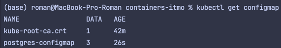

   **Или подробнее:**

   ```bash
   kubectl describe configmap postgres-configmap
   ```

- **Проверить Service:**

   ```bash
   kubectl get service
   ```

   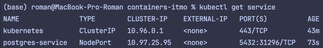

   **Или подробнее:**

   ```bash
   kubectl describe service postgres-service
   ```

- **Проверить Deployment:**

   ```bash
   kubectl get deployment
   ```

   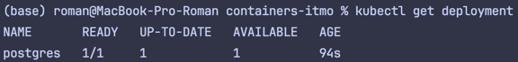

   **Или подробнее:**

   ```bash
   kubectl describe deployment postgres
   ```

- **Проверить поды:**

   ```bash
   kubectl get pods
   ```

   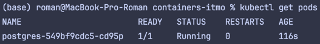

**Шаг 4.** Создать `nextcloud.yml` и повторить для него шаги 1–3. Чтобы создать объекты в Kubernetes с помощью манифестов, необязательно делить их на отдельные YAML-файлы, можно сделать один большой, с разделителем `---`, как в примере ниже. Значения для пользователя и пароля изменить на свое, остальные — по желанию.

- **Создать файл `nextcloud.yml`** с содержимым:

   ```yaml
   apiVersion: v1
   kind: Secret
   metadata:
     name: nextcloud-secret
     labels:
       app: nextcloud
   type: Opaque
   stringData:
     NEXTCLOUD_ADMIN_PASSWORD: "literally_any_password"
   ---
   apiVersion: apps/v1
   kind: Deployment
   metadata:
     name: nextcloud
     labels:
       app: nextcloud
   spec:
     replicas: 1
     selector:
       matchLabels:
         app: nextcloud
     template:
       metadata:
         labels:
           app: nextcloud
       spec:
         containers:
         - name: nextcloud
           image: docker.io/nextcloud:stable-apache
           resources:
             limits:
               cpu: 500m
               memory: 256Mi
             requests:
               cpu: 250m
               memory: 128Mi
           ports:
           - name: http
             containerPort: 80
             protocol: TCP
           env:
           - name: NEXTCLOUD_UPDATE
             value: '1'
           - name: ALLOW_EMPTY_PASSWORD
             value: 'yes'
           - name: POSTGRES_HOST
             value: postgres-service
           - name: POSTGRES_DB
             valueFrom:
               configMapKeyRef:
                 name: postgres-configmap
                 key: POSTGRES_DB
           - name: NEXTCLOUD_TRUSTED_DOMAINS
             value: "127.0.0.1"
           - name: POSTGRES_USER
             valueFrom:
               configMapKeyRef:
                 name: postgres-configmap
                 key: POSTGRES_USER
           - name: POSTGRES_PASSWORD
             valueFrom:
               configMapKeyRef:
                 name: postgres-configmap
                 key: POSTGRES_PASSWORD
           - name: NEXTCLOUD_ADMIN_USER
             value: any_name_you_want
           - name: NEXTCLOUD_ADMIN_PASSWORD
             valueFrom:
               secretKeyRef:
                 name: nextcloud-secret
                 key: NEXTCLOUD_ADMIN_PASSWORD
           imagePullPolicy: IfNotPresent
         restartPolicy: Always
         dnsPolicy: ClusterFirst
   ```

- **Создать объекты из манифеста:**

   ```bash
   kubectl create -f nextcloud.yml
   ```

   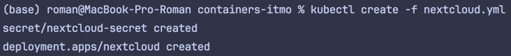

- **Можно обратить внимание, что при попытке посмотреть секрет, содержимое не показывается:**

   ```bash
   kubectl get secret
   ```

   ```bash
   kubectl describe secret nextcloud-secret
   ```

   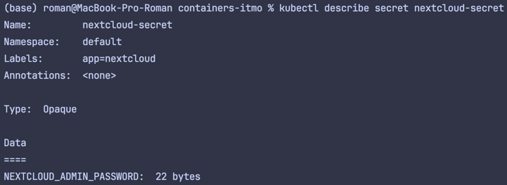

**Шаг 5.** После успешного запуска пода можно проверить его состояние с помощью команды:

   ```bash
   kubectl get pods
   ```

   

   **Чтобы посмотреть логи пода Nextcloud:**

   ```bash
   kubectl logs имя_пода
   ```

   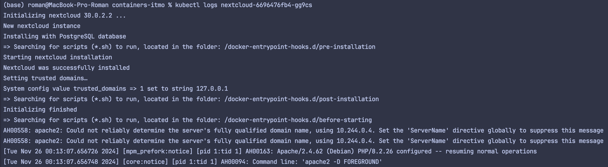

   Узнать имя пода можно из вывода предыдущей команды.

   Nextcloud начнет установку (самоинициализацию) автоматически, какое-то время следует подождать до ее успешного завершения. ⏳

---

### 🌐 Часть 3. Подключение извне

В предыдущих частях была успешно создана БД Postgresql, к которой подключается сервис Nextcloud.

Чтобы начать им пользоваться, необходимо осуществить доступ к самому интерфейсу сервиса, для этого обычно используется **Ingress**.

К сожалению, работа с ингрессами на локальных экземплярах minikube (особенно на порте 80) затруднена, поэтому будет использоваться встроенный функционал minikube, конкретно **Service + NodePort**.

**Шаг 1.** Кроме уже упомянутого способа выше (через манифест), объект типа **Service** для конкретного деплоймента можно создать специальной командой `kubectl expose deployment имя_деплоймента параметры_перенаправления`, которая автоматически обеспечит нужное перенаправление портов. При локальном использовании minikube удобнее всего работать с **NodePort**, т.е. форвардинг трафика через саму ноду minikube. Сама команда:

- ```bash
  kubectl expose deployment nextcloud --type=NodePort --port=80
  ```

**Шаг 2.** Осуществить туннелирование трафика между нодой minikube и Сервисом с помощью команды `minikube service имя_сервиса`. Команда “захватит” терминал на все время выполнения (в данном случае до ручного прерывания по `Ctrl-C`).

Если все предыдущие шаги выполнены правильно и нигде не было ошибок, то после выполнения команды должно открыться вкладка в браузере с сервисом Nextcloud. Чтобы залогиниться, надо ввести логин и пароль, указанные в манифесте ранее (переменные `NEXTCLOUD_ADMIN_USER`, `NEXTCLOUD_ADMIN_PASSWORD`). Сама команда:

- ```bash
  minikube service nextcloud
  ```

  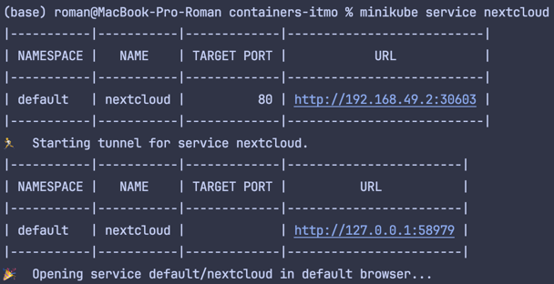

  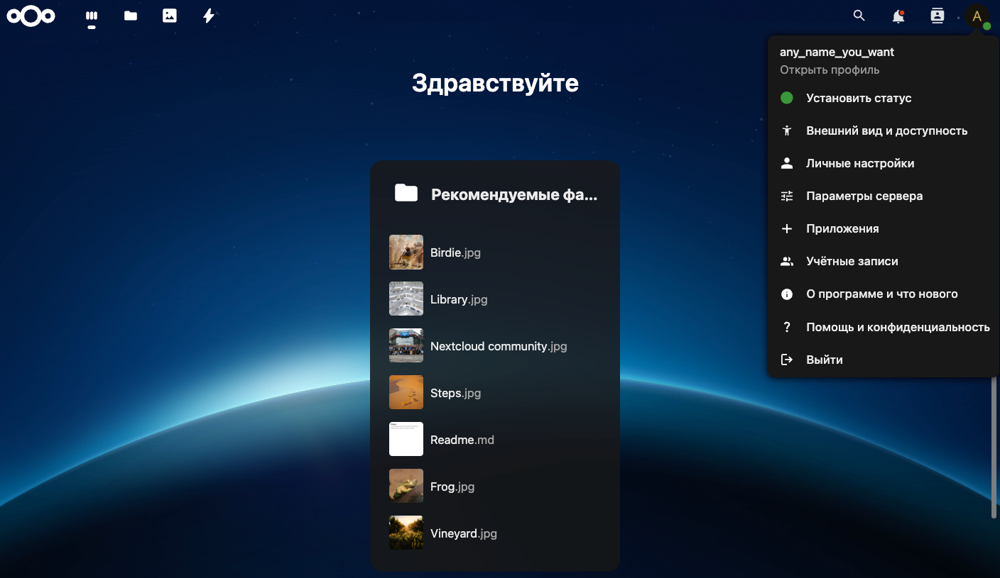

**Шаг 3.** Установить дополнительный компонент **dashboard** для minikube, команда `minikube dashboard --url`. Полученный URL вставить в адресную строку браузера, если не откроется само (выполненная команда, вероятно, “захватит” терминал, но он больше и не понадобится). Можно походить по страницам, посмотреть на все ранее созданные объекты уже на дашборде, удалить, создать новые, отредактировать.

  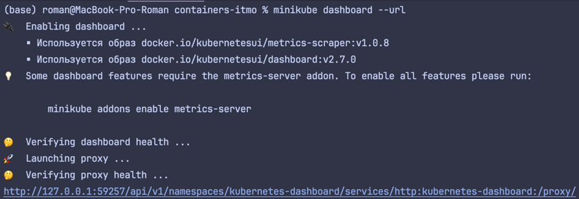

  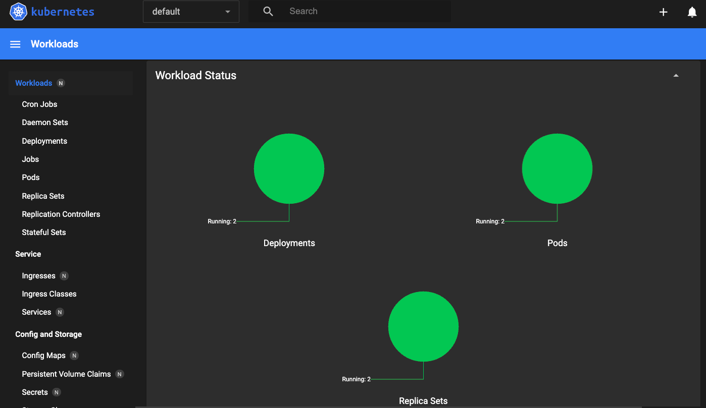

💡 **Вопрос:** _Что (и почему) произойдет, если отскейлить количество реплик postgres-deployment до 0, затем обратно до 1, после чего попробовать снова зайти на Nextcloud?_

**Ответ:** Если уменьшить количество реплик деплоймента PostgreSQL до 0, все поды, отвечающие за работу базы данных, будут остановлены и удалены. Это приведёт к недоступности базы данных. В результате, при попытке зайти на Nextcloud, сервис не сможет установить соединение с базой данных и выдаст ошибку.

Когда количество реплик будет снова увеличено до 1, Kubernetes запустит новый под с PostgreSQL. Однако все предыдущие данные базы будут потеряны, так как они хранились внутри удалённого пода. Следовательно, Nextcloud обнаружит, что база данных пуста.

1. **Скалирование деплоймента PostgreSQL до 0 реплик:**

   ```bash
   kubectl scale deployment postgres --replicas=0
   ```

2. **Устранение пода, чтобы потом он пересоздался:**

   ```bash
   kubectl delete pods -l app=nextcloud
   ```

3. **Скалирование деплоймента PostgreSQL обратно до 1 реплики:**

   ```bash
   kubectl scale deployment postgres --replicas=1
   ```

---

## 🎯 **Задание**

Осуществить изменения над манифестами из примера, чтобы получить следующее:

- 🔹 **Для PostgreSQL перенести `POSTGRES_USER` и `POSTGRES_PASSWORD` из ConfigMap в Secret** (очевидно, понадобится новый манифест для сущности **Secret**).
- 🔹 **Для Nextcloud перенести его переменные (`NEXTCLOUD_UPDATE`, `ALLOW_EMPTY_PASSWORD` и проч.) из Deployment в ConfigMap** (очевидно, понадобится новый манифест для сущности **ConfigMap**).
- 🔹 **Для Nextcloud добавить `Liveness` и `Readiness` пробы**.

---

## 💡 Решение

Файлы конфигураций для задания находятся в папке `main-task-files`.

### 1️⃣ Удаление предыдущих конфигураций

```bash
kubectl delete -f nextcloud.yml
```

```bash
kubectl delete -f pg_configmap.yml
```

```bash
kubectl delete -f pg_deployment.yml
```

```bash
kubectl delete -f pg_service.yml
```

### 2️⃣ Применение новых конфигураций

```bash
kubectl apply -f pg_configmap.yml
```

```bash
kubectl apply -f pg_secret.yml
```

```bash
kubectl apply -f pg_deployment.yml
```

```bash
kubectl apply -f nextcloud_configmap.yml
```

```bash
kubectl apply -f nextcloud.yml
```

```bash
kubectl apply -f pg_service.yml
```

### 3️⃣ Проверка состояния ресурсов и подов

```bash
kubectl get all
```

```bash
kubectl get pods
```