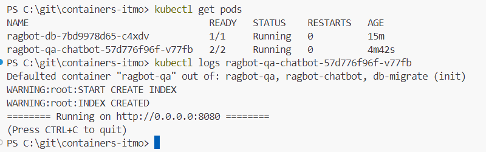
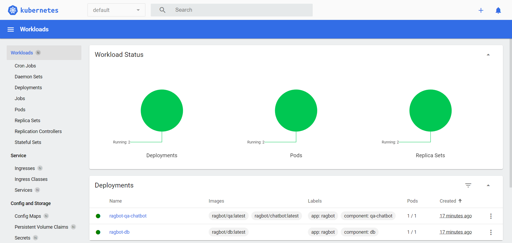
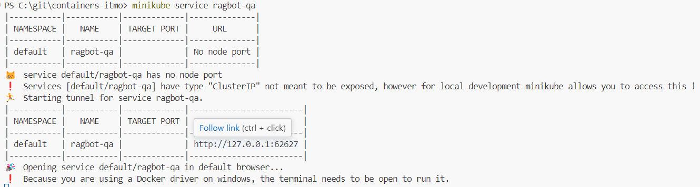
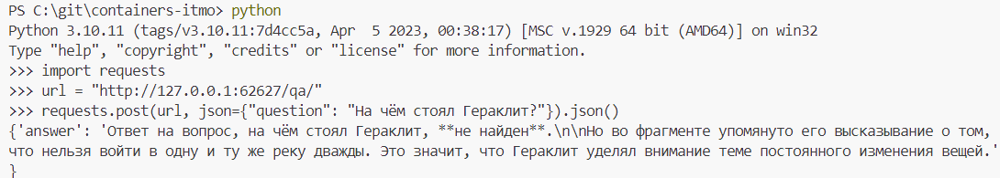

# Лабораторная работа №4 (More Kubernetes) по курсу ИТМО "Контейнеризация и оркестрация приложений"

**Авторы:** Неронов Роман, Низамов Тимур — AI Talent Hub

[[notion](https://jasper-cause-ce0.notion.site/4-More-Kubernetes-e2690d6f8ae3419790b1e0f16f59142d)]

## Требования

- минимум два `Deployment`, по количеству сервисов
- кастомный образ для минимум одного `Deployment` (т.е. не публичный и собранный из своего *Dockerfile*)
- минимум один `Deployment` должен содержать в себе контейнер и инит-контейнер
- минимум один `Deployment` должен содержать `volume` (любой)
- обязательно использование `ConfigMap` и/или `Secret`
- обязательно `Service` хотя бы для одного из сервисов (что логично, если они работают в связке)
- `Liveness` и/или `Readiness` пробы минимум в одном из `Deployment`
- обязательно использование лейблов (помимо обязательных `selector/matchLabel`, конечно)

Можно использовать Minikube из ЛР 3. Нужно развернуть сервис в связке из минимум 2 контейнеров + 1 init, по аналогии с ЛР 2.

## Описание тестового приложения

Чат-бот ИИ-персоны "Аристотель", который отвечает на вопросы по книге "Метафизика" и состоит из сервисов:

 - db: база данных PostgreSQL с расширением PGVector
 - db-migrate: выполнение миграций в среде python с помощью alembic
 - chatbot: обработчики событий чат-бота Telegram
 - qa: микросервис RAG-системы для ответов на вопросы по книге Аристотеля "Метафизика"

## Ход работы

По аналогии с [лабой 2](https://github.com/nizamovtimur/containers-itmo/tree/lab2) составлены следующие манифесты:
 * [configmap.yaml](configmap.yaml) — конфигурации для компонентов
 * [secret.yaml](secret-example.yaml) — секреты (пример см. secret-example.yaml)
 * [db-deployment.yaml](db-deployment.yaml) — деплоймент БД
 * [qa-chatbot-deployment.yaml](qa-chatbot-deployment.yaml) — деплоймент вопрос-ответного модуля и чат-бота
 * [db-service.yaml](db-service.yaml) — сервис БД
 * [qa-service.yaml](qa-service.yaml) — сервис вопрос-ответного модуля

Сборка образов:
```shell
& minikube -p minikube docker-env --shell powershell | Invoke-Expression
docker compose build
```

Применение манифестов:
```shell
kubectl apply -f configmap.yaml
kubectl apply -f secret.yaml
kubectl apply -f db-deployment.yaml
kubectl apply -f qa-chatbot-deployment.yaml
kubectl apply -f db-service.yaml
kubectl apply -f qa-service.yaml
```

## Результат

Статус работы приложения (`kubectl get pods` и `kubectl logs`):



Скриншот `minikube dashboard --url`:



Пример обращения к API QA (`minikube service ragbot-qa`):




